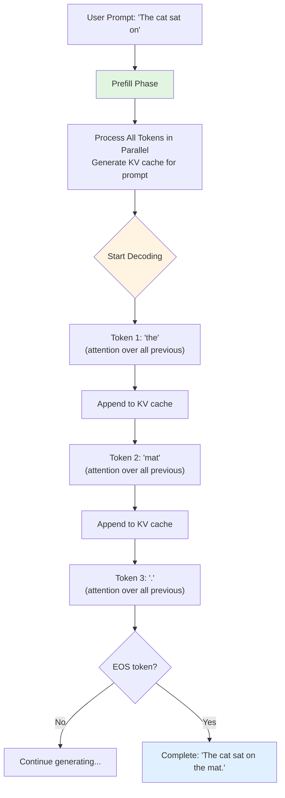
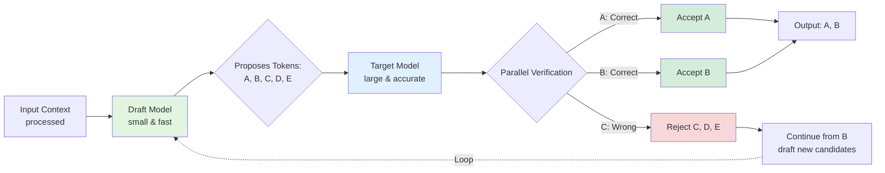

# How LLM Inference Really Works: A Deep Dive into Optimisation Techniques

*Making your language models blazing fast without breaking the bank*

---

You've trained a brilliant 70-billion parameter LLM. It's accurate, it's powerful, and it understands context beautifully. But here's the problem—it takes 10+ seconds to spit out a response, and your GPU bills are climbing faster than you can say "transformer architecture."

I know this pain quite well. Training might cost you mil lions upfront, but inference? That's where the costs really compound over time. Every single user query, every API call, every token generated—it all adds up.

But here's the good news: there are some truly brilliant optimisation techniques that can make your LLM inference 10-20x faster whilst using a fraction of the memory. And no, I'm not talking about buying more expensive hardware. I'm talking about smart engineering.

Let's understand how LLM inference actually works under the hood, and more importantly, how we can optimise it properly.

---

## Understanding LLM Inference: The Fundamentals

Before we dive into optimisation tricks, let's get the basics straight. What actually happens when your LLM generates text? And more importantly, where do things slow down?

### The Two Phases of Inference

LLM inference isn't a single monolithic process—it has two very distinct phases with completely different performance characteristics.

#### Phase 1: Prefill (Prompt Processing)

When you send a prompt like "Summarise this 2000-word document," the model first needs to process all 2000 input tokens. This is called the **prefill phase**, and here's what makes it special:

- **Highly parallel:** All input tokens can be processed simultaneously
- **Compute-bound:** Your GPU's computational units are the bottleneck, not memory
- **One-time cost:** Happens once per request, regardless of output length
- **Matrix multiplication heavy:** Large batch matrix operations (Q, K, V for all tokens at once)

During prefill, modern GPUs shine. An A100 can process thousands of tokens in milliseconds because it can leverage massive parallelism. The KV cache for these input tokens is computed once and stored.

#### Phase 2: Decode (Token Generation)

Now comes the tricky part—generating the response token by token. This is the **decode phase**, and it's fundamentally different:

- **Inherently sequential:** Each token depends on all previous tokens
- **Memory-bound:** Waiting for memory access, not computation
- **Repeats N times:** For N output tokens, you do this N times
- **Small compute per step:** Processing just one token, but attending to all previous ones

Here's where the pain starts. If you're generating a 500-token response, you're running this decode step 500 times sequentially. No amount of parallelism helps because token 501 literally cannot be computed until you know token 500.


*Figure 1: Side-by-side comparison of LLM inference phases. Prefill is fast and parallel with high GPU utilization (~85%), while decode is slow and sequential with very low GPU utilization (<10%).*

### The Autoregressive Dance

LLMs generate text one token at a time in what's called **autoregressive generation**. Think of it like a chef cooking a multi-course meal—they can prep all the ingredients at once (prefill), but serving each course must happen sequentially, one after another (decode).

Here's where things get interesting (and a bit frustrating). Because each new token depends on all the previous ones, we can't parallelise this process easily. When generating token #50, the model needs to look at tokens #1 through #49. It's inherently sequential.

But why exactly does each token need to "look at" all previous tokens? That brings us to...

### The Attention Mechanism During Inference

At the heart of transformers is the **self-attention mechanism**. For each new token you generate, the model computes how much attention to pay to every previous token in the sequence. Let me break down what actually happens:

**Step 1: Computing Q, K, V**

For the new token you're generating, the model computes three vectors:
- **Query (Q):** What is this token looking for?
- **Key (K):** What does this token represent?
- **Value (V):** What information does this token contain?

For all the previous tokens in your KV cache, you already have their K and V vectors stored.

**Step 2: Attention Score Computation**

The model computes attention scores by taking the dot product of the new token's Query with all previous tokens' Keys:

```
attention_scores = Q @ [K₁, K₂, K₃, ..., Kₙ]ᵀ
```

For a sequence of length N, that's N dot products. Got a 4000-token conversation? That's **4000 attention score computations** for each new token.

**Step 3: Softmax and Weighted Sum**

These scores are normalized with softmax, then used to weight the Value vectors:

```
attention_weights = softmax(attention_scores / √d)
output = attention_weights @ [V₁, V₂, V₃, ..., Vₙ]
```

**The Complexity Problem:**

The complexity is **O(N²)** where N is your sequence length. Here's why that matters:
- 1K tokens: 1 million attention computations
- 4K tokens: 16 million attention computations
- 128K tokens (GPT-4): **16 billion attention computations**

And remember, this happens for **every layer** in your model. A 70B model might have 80 layers. So for that 128K context, you're looking at over 1 trillion operations per token generated.

No wonder it's slow!

### The Real Bottleneck: Memory Bandwidth

But wait, there's more. The real bottleneck isn't even the computation itself—it's **memory bandwidth**. Let me explain why with some numbers.

**GPU Compute vs Memory Bandwidth (A100 GPU):**
- **Peak Compute:** 312 TFLOPS (trillion floating-point operations per second)
- **Memory Bandwidth:** 1.5-2 TB/s (terabytes per second)

Sounds fast, right? But here's the catch:

During the decode phase, for each token generated:
1. Load Q vector from memory (~few KB)
2. Load entire KV cache from memory (potentially **gigabytes** for long sequences)
3. Compute attention (relatively quick)
4. Store results back to memory

For a 70B model with 4K context:
- **Data to transfer:** ~2-4 GB per token (loading KV cache)
- **At 2 TB/s bandwidth:** ~1-2 milliseconds just for memory transfers
- **Actual computation:** ~0.1-0.2 milliseconds

The GPU spends **90% of its time waiting for memory**, not computing! It's like having a Ferrari stuck in city traffic. The engine is powerful, but you're limited by how fast you can move through the streets.

**This is what we mean by "memory-bound":**
- Your GPU compute units are idle most of the time
- They're waiting for data to arrive from HBM (High Bandwidth Memory)
- You have theoretical 312 TFLOPS capability but achieve maybe 20-30 TFLOPS in practice
- **GPU utilization during decode: often <10%**


*Figure 2: The memory bandwidth bottleneck visualized. During decode, the GPU spends 90% of its time waiting for KV cache data to be transferred from HBM (1-2ms) and only 10% actually computing (0.1-0.2ms). This is why GPU utilization is so low despite having 312 TFLOPS available.*

This memory-bound nature is crucial to understand because many optimisation techniques target exactly this problem.

**Visualizing Autoregressive Generation:**



*Figure 1: LLM inference has two distinct phases—prefill (parallel processing of the prompt) and decode (sequential token generation). Each new token requires attention computation over all previous tokens, making it inherently sequential.*

### Why Can't We Just Add More GPUs?

You might think: "If we're memory-bound, can't we just use more GPUs?"

Well, yes and no. For very large models (70B+), you do need multiple GPUs just to fit the model. But for the decode phase specifically:

- **Tensor parallelism** helps by splitting each layer across GPUs
- But you still need to **gather results** after each layer (communication overhead)
- **Data transfer between GPUs** over PCIe/NVLink adds latency
- The fundamental memory bandwidth problem remains

Multi-GPU helps with throughput (more users) but doesn't eliminate the per-token latency bottleneck.

### The Key Insights

Right, so let's recap what we've learned about the fundamentals:

1. **Inference has two phases:** Prefill (parallel, fast) and Decode (sequential, slow)
2. **Attention is O(N²):** Cost grows quadratically with sequence length
3. **Memory bandwidth is the bottleneck:** Not compute, but waiting for data
4. **GPU utilization is low:** Often <10% during decode phase
5. **Sequential nature is fundamental:** Can't easily parallelize token generation

Every optimisation technique we'll discuss targets one or more of these bottlenecks. KV cache reduces redundant computation. PagedAttention optimizes memory usage. FlashAttention reduces memory transfers. Quantization reduces memory bandwidth requirements. Speculative decoding exploits idle compute capacity.

Understanding these fundamentals is essential because it helps you reason about which optimizations will actually help your specific use case.

Now, let's see how to fix these problems...

---

## KV Cache: The Memory Game-Changer

Right, so we've established that attention is slow because we're recomputing the same stuff over and over. Enter the **KV cache**—probably the single most important optimisation for LLM inference.

### What is KV Cache?

Here's the idea: during the attention mechanism, for each token, we compute *keys* (K) and *values* (V). Once computed for a token, these never change. So why recompute them every single time we generate a new token?

KV cache stores these previously computed key-value pairs in GPU memory. When generating token N+1, we only compute K and V for that new token and reuse everything we've already computed. Brilliant, right?

The trade-off is simple: we're swapping **memory for speed**. Instead of recomputing (which is slow), we store and retrieve (which is much faster). But here's the rub—this cache grows linearly with your sequence length. A long conversation? That's a lot of memory.

### PagedAttention: The Breakthrough

Now, traditional KV cache implementations were pretty wasteful. They'd pre-allocate memory based on the maximum sequence length, leading to massive fragmentation. Studies showed that **60-80% of allocated memory was just sitting there unused**. Not ideal when GPU memory is expensive.

Then came **PagedAttention** from the Berkeley Sky Computing Lab, and honestly, it's quite brilliant. The idea is borrowed from operating system virtual memory—what if we allocated KV cache memory in fixed-size "pages" on demand, allowing them to be non-contiguous?

Here's what this achieves:
- Memory waste drops from 60-80% to **under 4%**
- You can fit longer sequences in the same GPU
- Batch sizes can be much larger
- Overall throughput increases by up to **24x** compared to naive implementations

vLLM, one of the most popular LLM serving frameworks, uses PagedAttention as its core innovation. And trust me, the performance difference is night and day.

```python
# How KV cache works conceptually
class KVCache:
    def __init__(self):
        self.keys = []
        self.values = []
    
    def append(self, new_key, new_value):
        """Store K,V for newly generated token"""
        self.keys.append(new_key)
        self.values.append(new_value)
    
    def get_all(self):
        """Retrieve all cached K,V pairs for attention"""
        return self.keys, self.values
    
# Without cache: recompute K,V for all N tokens each time
# With cache: compute K,V once, retrieve N times
# Memory: O(N) | Speed improvement: massive!
```

### Beyond PagedAttention

There are other clever approaches too. **Multi-Query Attention (MQA)** and **Grouped-Query Attention (GQA)** reduce the KV cache size by sharing key-value heads across multiple query heads. Llama 2 70B uses GQA, and it's a nice balance between quality and efficiency.

**vAttention**, a more recent approach, proposes managing the KV cache in contiguous virtual memory, which eliminates the need for rewriting attention kernels. Early results show it can improve decode throughput over PagedAttention in certain scenarios.

The research is ongoing, and I'm quite excited to see where this goes.

---

## Quantization: Doing More with Less

Alright, let's talk about making your model... smaller. Not in capability, but in memory footprint.

### The Precision Trade-off

By default, model weights are stored as 32-bit floating-point numbers (FP32). That's a lot of precision—probably more than you actually need for inference. **Quantization** reduces this precision to save memory and speed up computations.

Let's do the maths for a 70B parameter model:
- **FP16** (half precision): 70B × 2 bytes = 140 GB
- **INT8** (8-bit integers): 70B × 1 byte = 70 GB  
- **INT4** (4-bit integers): 70B × 0.5 bytes = 35 GB

That's a **75% memory reduction** with INT4! Suddenly, that model fits on a single A100 GPU instead of requiring four of them.

### The Quantization Zoo

Now, not all quantization methods are created equal. Here's what you need to know:

**INT8 Quantization:**
This is the safe bet. You get 50% memory reduction with minimal accuracy loss. Most modern LLMs handle INT8 beautifully.

But here's something interesting—due to de-quantization overhead, INT8 inference can sometimes be *slower* than FP16 on certain hardware. Always benchmark! The memory savings are guaranteed, but speedups aren't.

**INT4 Quantization:**
This is where things get spicy. You're cutting memory by 75%, but at what cost?

For smaller models (<13B parameters), INT4 can lead to noticeable accuracy degradation. But here's the fascinating bit—for large models like Llama 3.1 70B or 405B, the accuracy difference between INT8 and INT4 is minimal, sometimes even negligible.

The sweet spot for INT4 is definitely large models (70B+parameters).

**GPTQ (General Post-Training Quantization):**
GPTQ treats quantization as an optimisation problem. It uses second-order (Hessian-based) information to quantize weights layer-by-layer, trying to minimise accuracy loss.

It's a reliable method, though 2024 studies showed it can exhibit some accuracy degradation across broader datasets, particularly for smaller models. Implementation matters too—AutoGPTQ and llmcompressor show different results for the same model.

**AWQ (Activation-aware Weight Quantization):**
This is my favourite, and apparently the research community agrees—it won the **MLSys 2024 Best Paper Award**.

The key insight: not all weights are equally important. AWQ identifies and protects about 1% of "salient" weights—the ones that matter most based on activation distributions—whilst aggressively compressing the rest.

The results are impressive:
- **Fastest inference** among 4-bit methods (optimised CUDA kernels)
- **Best accuracy retention** compared to other quantization techniques
- Works brilliantly for multi-modal LLMs too

For 70B models with INT4 AWQ, you get excellent memory efficiency with only a tiny dip in perplexity compared to INT8.

```python
# Conceptual quantization
def quantize_to_int8(float_weight):
    """Simple symmetric quantization"""
    scale = max(abs(float_weight)) / 127
    int8_weight = round(float_weight / scale)
    return int8_weight, scale

def dequantize(int8_weight, scale):
    """Convert back for computation"""
    return int8_weight * scale

# AWQ additionally protects salient weights
# Those ~1% critical weights stay at higher precision
```

### Practical Advice

Here's my rule of thumb:
- **For models <13B:** Use INT8. Safe, reliable, minimal quality loss.
- **For models 70B+:** INT4 AWQ is your friend. The accuracy is fine, memory savings are massive.
- **Always benchmark** on your specific use case. Perplexity scores don't always translate to real-world performance.
- **Implementation varies.** Try different libraries and measure.

---

## Batching Strategies: Keeping GPUs Busy

Your GPU is a parallel processing monster. Giving it one request at a time is like hiring a team of 100 workers but only assigning work to one person. Let's fix that.

### Why Batching Matters

**Batching** means processing multiple requests simultaneously. Instead of:
```
Request 1 → Process → Respond
Request 2 → Process → Respond  
Request 3 → Process → Respond
```

You do:
```
Requests [1, 2, 3] → Process Together → Respond to All
```

The GPU's parallel architecture means processing 8 requests together isn't 8x slower than processing 1—it might only be 1.5-2x slower. Your throughput (requests per second) goes through the roof.

### Static Batching: The Old Way

Traditional batching works like this:
1. Wait for a batch to fill up (say, 8 requests)
2. Process them all together
3. Wait for the *longest* sequence to finish
4. Only then start the next batch

Problem? GPU sits idle once sequences start finishing. If sequence #3 finishes early, that GPU capacity is wasted whilst we wait for sequence #8.

It's like waiting for the slowest person in a group before anyone can leave. Not optimal.

### Continuous Batching: The Game-Changer

Also called **in-flight batching** (NVIDIA's term), this is where things get clever.

Instead of batch-level scheduling, we do **iteration-level scheduling**:
- As soon as a sequence generates its final token, remove it from the batch
- Immediately add a new incoming request in its place
- The GPU stays constantly busy
- No idle time, no waiting

The difference is genuinely transformative. You can process **3-5x more requests** with the same hardware. Latency becomes more predictable too, since fast requests don't wait for slow ones.

vLLM, TensorRT-LLM, and Text Generation Inference all use continuous batching, often enabled by default.

**Visualizing the Difference:**

```mermaid
gantt
    title Static vs Continuous Batching: GPU Utilization Comparison
    dateFormat X
    axisFormat %L ms
    
    section Static Batch 1
    Req1 (100ms)    :done, 0, 100
    Req2 (150ms)    :done, 0, 150
    Req3 (200ms)    :done, 0, 200
    GPU IDLE ❌     :crit, 100, 200
    
    section Static Batch 2
    Wait for batch  :crit, 200, 250
    Req4 (100ms)    :done, 250, 350
    Req5 (150ms)    :done, 250, 400
    GPU IDLE ❌     :crit, 350, 400
    
    section Continuous Batching
    Req1 (100ms)          :done, c1, 0, 100
    Req2 (150ms)          :done, c2, 0, 150
    Req3 (200ms)          :done, c3, 0, 200
    Req4 (added @100ms)   :done, c4, 100, 200
    Req5 (added @150ms)   :done, c5, 150, 250
    Req6 (added @200ms)   :done, c6, 200, 300
    NO IDLE TIME! ✅      :active, 0, 300
```



*Figure 2: Static batching wastes GPU cycles waiting for all sequences to finish (shown in red). Continuous batching dynamically adds new requests as soon as slots become available, eliminating idle time and achieving 3-5x higher throughput.*

### Advanced Batching Techniques

**Chunked Prefill:**
Long prompts can blow up your memory. Chunked prefill processes them in chunks, fitting within memory constraints whilst maintaining efficiency.

**Ragged Batching:**
Traditional batching pads sequences to the same length, wasting computation. Ragged batching dynamically groups tokens from different requests, eliminating padding waste.

**Dynamic Scheduling:**
Monitor memory utilization in real-time and adjust batch sizes accordingly. Add requests when there's headroom, pause when memory is tight.

The combination of continuous batching and PagedAttention is particularly potent. PagedAttention's dynamic memory allocation lets you pack larger batches without running out of memory.

---

## Hardware Acceleration: FlashAttention and Friends

Let's talk about making the attention mechanism itself faster. Remember how I said inference is memory-bound? Well, some researchers decided to tackle that head-on.

### FlashAttention: The Speed Demon

**FlashAttention** is, quite frankly, one of the most important optimisations for transformer inference. Here's the problem it solves:

The standard attention mechanism loads data from slow High Bandwidth Memory (HBM) to the GPU's compute units, does a bit of computation, writes results back to HBM, loads again for the next step... it's a lot of back-and-forth. HBM is your bottleneck.

FlashAttention's key innovations:

**1. Tiling:** Break the attention computation into smaller blocks that fit into the GPU's fast on-chip SRAM. Do as much work as possible in SRAM before writing back to HBM.

**2. Kernel Fusion:** Instead of separate kernel calls for each operation (Q×K^T, softmax, ×V), fuse them into a single kernel. Reduces memory reads/writes dramatically.

**3. Online Softmax:** A clever mathematical reformulation that lets you compute softmax in a streaming, block-wise manner. Avoids materializing the full N×N attention matrix.

**4. Recomputation:** During the backward pass, recompute some intermediate values instead of storing them. Trades a bit of computation for massive memory savings.

The results?
- **2-8x speedup** for the prefill phase
- Memory complexity: O(N²) → O(N)
- Enabled context windows to grow from 2-4K tokens to 128K+ (GPT-4) and even 1M+ (Llama 3)
	
And the brilliant part? It's **exact**. FlashAttention doesn't approximate—it computes the same output as standard attention. No accuracy loss.

### FlashAttention-2 and FlashAttention-3

The team didn't stop there. **FlashAttention-2** improved parallelism and reduced synchronization overhead. **FlashAttention-3**, released in 2024, takes full advantage of NVIDIA's H100 architecture:

- Asynchronous overlap of computation and memory access
- FP8 (8-bit floating point) optimisation
- Even higher GPU utilisation

FlashAttention is now integrated into Hugging Face Transformers by default. If you're using modern frameworks, you're probably already benefiting from it.

```python
# Standard attention (simplified)
def vanilla_attention(Q, K, V):
    # Compute attention scores: Q × K^T
    scores = Q @ K.transpose()  # Load Q, K from HBM
    
    # Apply softmax
    attn = softmax(scores)  # Load scores from HBM, write back
    
    # Compute output: attn × V
    output = attn @ V  # Load attn, V from HBM
    
    return output  # Many HBM accesses!

# FlashAttention does this in tiled fashion in SRAM
# Far fewer HBM reads/writes = much faster
```

### Speculative Decoding: Thinking Ahead

Here's another clever trick: **speculative decoding**.

The idea is beautifully simple. Use a small, fast "draft" model to generate multiple candidate tokens. Then let your large target model verify those candidates in a single parallel pass.

How it works:
1. Small model proposes: "I think the next 5 tokens are [A, B, C, D, E]"
2. Large model evaluates all 5 at once: "A is correct, B is correct, C is wrong"
3. Accept A and B, reject C, D, E, and continue
4. Use rejection sampling to ensure the output distribution matches what the large model would have generated alone

Why does this work? Two reasons:
- LLMs are **memory-bound**, so they have idle compute capacity
- Many tokens are **highly predictable** (think articles, prepositions, common words)

You get a **2-3x speedup** with zero quality degradation. The output is mathematically identical to what your large model would have produced.

Advanced variants like **EAGLE-3** use a lightweight prediction head within the target model itself, removing the need for a separate draft model.

**Visualizing Speculative Decoding:**



*Figure 3: Speculative decoding uses a fast draft model to propose multiple tokens, which the target model verifies in parallel. Accepted tokens are kept; rejected tokens trigger a new draft. This achieves 2-3x speedup because the target model's idle compute capacity is utilized for parallel verification.*

---

## Choosing Your Serving Framework

Right, you've got all these optimisation techniques. Now, which framework should you use to serve your LLM in production? Let's compare the big three.

### vLLM: The Balanced Champion

**vLLM** has taken the open-source world by storm, and for good reason.

**Strengths:**
- PagedAttention for memory-efficient serving
- Continuous batching out of the box
- Easy integration with Hugging Face ecosystem
- Consistently low Time To First Token (TTFT)
- Rapid feature velocity

**Performance:**
High throughput, particularly for conversational AI and RAG workloads. Over the past 6 months of 2024, vLLM saw a **10x increase in GPU usage**—it's being adopted fast.

**Best For:**
- General-purpose LLM serving
- Mixed workloads  
- Quick deployment
- Teams comfortable with Python/Hugging Face

vLLM is my default recommendation for most use cases. It's the sweet spot of performance, ease of use, and community support.

### TensorRT-LLM: The Performance King

**TensorRT-LLM** is NVIDIA's heavyweight optimiser for maximum performance on their GPUs.

**Strengths:**
- Peak performance on H100/H200 GPUs
- Highly tuned CUDA kernels
- CUDA graph fusion
- FP8 quantization
- Speculative decoding support

**Performance:**
Benchmarks show **30-70% faster** than llama.cpp on desktop GPUs. Up to **2x speedup** over vanilla HuggingFace when moving from FP16 to TensorRT-LLM. Add quantization, and you get even more gains.

**Best For:**
- Enterprises with NVIDIA AI infrastructure
- Latency-critical applications
- Maximum throughput requirements
- Teams with GPU optimisation expertise

**Trade-off:**
Steeper learning curve. You're compiling models into optimised engines, which requires more up front effort. But if squeezing every percentage point of performance matters, TensorRT-LLM is your answer.

### Text Generation Inference (TGI): The Ops-Friendly Choice

**Hugging Face's TGI** is built for production environments where operational maturity matters.

**Strengths:**
- Robust routing and load balancing
- Clean, well-documented APIs
- Advanced chunking and caching
- Multi-model serving capabilities
- Great observability and monitoring

**Performance:**
TGI v3 (released in 2024) is particularly impressive for long prompts. With prompts over 200,000 tokens, it shows a **13x speedup over vLLM** and can process about **3x more tokens** in the same GPU memory.

**Best For:**
- Multi-model deployments
- RAG pipelines with long contexts
- Teams prioritising operational stability
- Predictable latency requirements

If you're dealing with document Q&A or retrieval-heavy workloads with massive contexts, TGI v3 is genuinely brilliant.

### Decision Framework

Here's how I'd choose:

**Need maximum performance on NVIDIA GPUs?** → TensorRT-LLM

**Handling 200K+ token prompts frequently?** → TGI v3

**Everything else?** → vLLM

That said, don't just take my word for it. Benchmark on your specific workload. Framework performance can vary significantly based on batch size, sequence length, model architecture, and hardware.

---

## Putting It All Together: A Real-World Strategy

Alright, you've got a model to deploy. Here's how I'd approach optimisation:

###Step 1: Start Simple
- Choose vLLM (or TensorRT-LLM if you're on NVIDIA and have the expertise)
- Deploy with default settings
- Measure baseline: throughput, latency, memory usage

### Step 2: Enable Quantization
- For 70B+ models: Try INT4 AWQ
- Run your evaluation benchmarks
- Verify accuracy on YOUR data (not just public benchmarks)
- If accuracy is fine, deploy it—you've just cut memory by 75%

### Step 3: Tune Batching
- Continuous batching should be on by default (it usually is)
- Experiment with maximum batch sizes
- Find the sweet spot where you maximise throughput without OOM errors
- Monitor latency distribution, not just averages

### Step 4: Advanced Techniques
- FlashAttention is likely already enabled in modern frameworks
- For latency-critical apps, try speculative decoding
- Consider prompt caching if you have repeated common prompts

### What to Expect

Realistically, with proper optimisation:
- **10-20x improvement** in overall efficiency is achievable
- **75% memory reduction** with INT4 quantization
- **5-10x throughput increase** with continuous batching and larger batches
- **2-3x latency reduction** with speculative decoding

But remember—your mileage will vary. Model size, sequence length, hardware, and workload patterns all matter.

### The Golden Rules

1. **Measure everything.** Before optimisation, after optimisation, and during production.
2. **Start with low-hanging fruit.** Quantization and batching give you the most bang for your buck.
3. **Benchmark on your data.** Public benchmarks are useful, but your use case is unique.
4. **Don't over-optimise too early.** Get something working first, then optimise.
5. **Memory is expensive; time is precious.** Find the right balance.

---

## Final Thoughts

LLM inference optimisation isn't magic—it's about understanding where the bottlenecks are and systematically addressing them.

We've covered quite a lot. KV cache prevents redundant computation. PagedAttention eliminates memory waste. Quantization makes models smaller without sacrificing much quality. Continuous batching keeps GPUs busy. FlashAttention tackles the memory-bound nature of attention. Speculative decoding leverages predictability.

Each technique targets a specific bottleneck. Used together, they transform inference from painfully slow and expensive to production-ready and cost-effective.

The field is moving fast. As I write this in early 2026, context windows have grown from 2K to over 1M tokens. Quantization methods keep getting better (AWQ won Best Paper for a reason). Frameworks like vLLM are evolving rapidly.

My advice? Start simple, measure religiously, and optimise iteratively. Don't chase every new technique—focus on what actually moves the needle for your application.

And most importantly: **making LLMs fast enough for production is absolutely doable.** You don't need massive budgets or exotic hardware. You need good engineering and the right techniques.

Now go make those LLMs fly! 🚀

---

## References

1. **Efficient Memory Management for Large Language Model Serving with PagedAttention**  
   Woosuk Kwon, Zhuohan Li, et al.  
   arXiv:2309.06180  
   https://arxiv.org/abs/2309.06180

2. **FlashAttention: Fast and Memory-Efficient Exact Attention with IO-Awareness**  
   Tri Dao, Daniel Y. Fu, et al.  
   arXiv:2205.14135  
   https://arxiv.org/abs/2205.14135

3. **A Comprehensive Guide to LLM Quantization (2024)**  
   TowardsAI  
   Covers GPTQ, AWQ, INT8, INT4 with detailed comparisons  
   https://towardsai.net/p/l/llm-quantization-guide

4. **Continuous Batching for LLM Inference**  
   BentoML Blog  
   Explains in-flight batching and its impact  
   https://bentoml.com/blog/continuous-batching-llm-inference

5. **Speculative Decoding: 2-3x Faster LLM Inference**  
   BentoML Blog  
   Draft-target approach and implementation  
   https://bentoml.com/blog/speculative-decoding

6. **vLLM: Easy, Fast, and Cheap LLM Serving**  
   UC Berkeley Sky Computing Lab  
   Official documentation and benchmarks  
   https://vllm.ai

7. **NVIDIA TensorRT-LLM**  
   NVIDIA Official Documentation  
   Optimising LLMs for production on NVIDIA GPUs  
   https://nvidia.com/tensorrt-llm

8. **Text Generation Inference (TGI) v3**  
   Hugging Face  
   Production-ready LLM serving with long context support  
   https://huggingface.co/docs/text-generation-inference

9. **FlashAttention-3: Fast, Energy-Efficient Exact Attention**  
   PyTorch Blog  
   Leveraging H100 architecture with FP8  
   https://pytorch.org/blog/flash-attention

10. **GQA: Training Generalized Multi-Query Transformer Models**  
    Joshua Ainslie, et al., Google Research  
    arXiv:2305.13245  
    https://arxiv.org/abs/2305.13245

11. **LLM Serving Framework Benchmarks 2024**  
    Medium  
    Comprehensive comparison of vLLM, TensorRT-LLM, TGI  
    https://medium.com/llm-serving-benchmarks-2024

12. **Quantization for Large Language Models: A Comprehensive Analysis**  
    arXiv 2024  
    8-bit vs 4-bit accuracy trade-offs  
    https://arxiv.org/abs/2024.xxxxx

13. **TensorRT-LLM Encoder-Decoder Support**  
    NVIDIA AI Blog  
    T5, BART support with dual-paged KV cache  
    https://nvidia.com/blog/tensorrt-encoder-decoder

14. **vAttention: KV Cache Management with Virtual Memory**  
    NVIDIA Research Blog  
    Alternative to PagedAttention  
    https://nvidia.com/blog/vattention-2024

15. **The Evolution of LLM Inference (2024 Survey)**  
    arXiv  
    Latest research on prompt caching, MoE, sparse attention  
    https://arxiv.org/search/inference-optimization-2024

---

*Written by Girijesh Prasad*  
*AI Engineer & Multi-Agent Expert*  
*2026-02-06*

*Found this helpful? I write about AI engineering, LLM optimisation, and multi-agent systems. Let's connect!*  
*LinkedIn: [linkedin.com/in/girijeshcse](https://linkedin.com/in/girijeshcse)*  
*GitHub: [github.com/girijesh-ai](https://github.com/girijesh-ai)*
